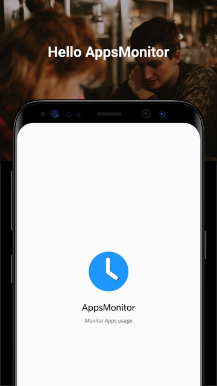
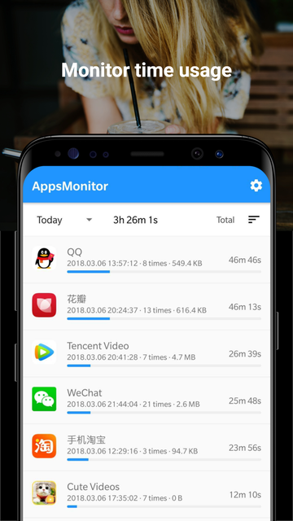
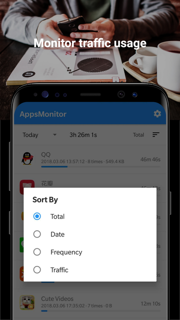
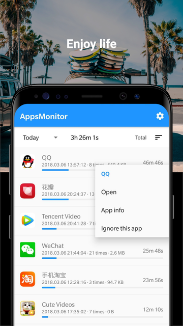

# AppsMonitor
Android apps for monitoring apps usage on your device

## What does this App do ?

This app can:

- monitor each App usage time
- monitor each App traffic usage

## Screen shortcut

## How to build

`./gradlew clean && ./gradlew assembleRelease`

## or Download

[Release]
[GooglePlay]

## Notes

- This Apps only for Android 5.1 and about i.e API level 22+
- To enjoy this apps, please grant app usage permission
- You can usage this apps without any worry, since i will never collect your information

## Feedback
bluedares@gmail.com

## Thanks

